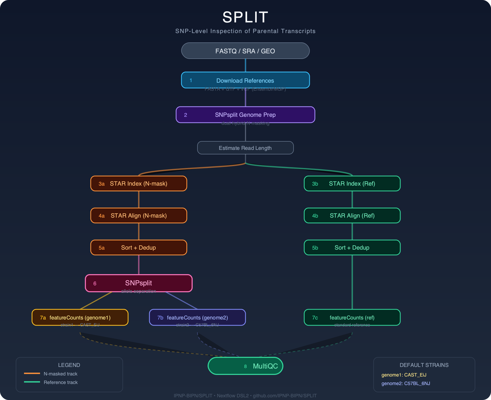

# SPLIT 🧬

**S**NP-Level **I**nspection of **P**arental **T**ranscripts

[](https://www.nextflow.io/)
[](https://opensource.org/licenses/MIT)

Nextflow DSL2 pipeline for **allele-specific RNA-seq** analysis using STAR, SNPsplit, and featureCounts.
Ultra-minimalist — 2 files only (`main.nf` + `nextflow.config`). Designed for solo bioinformaticians.

---

## Pipeline Overview

<p align="center">
  
</p>

<details>
<summary>Text diagram</summary>

```
  FASTQ / SRA / GEO
         │
         ▼
  1. Download References (FASTA + GTF + VCF)
         │
         ▼
  2. SNPsplit Genome Prep (dual-hybrid N-masking)
         │
         ▼
    Estimate Read Length
         │
    ┌────┴────┐
    ▼         ▼
  3a. STAR   3b. STAR
  Index      Index
  (N-mask)   (Ref)
    │         │
    ▼         ▼
  4a. STAR   4b. STAR
  Align      Align
    │         │
    ▼         ▼
  5a. Sort   5b. Sort
  + Dedup    + Dedup
    │         │
    ▼         │
  6. SNPsplit │
  (allele    │
  separation)│
    │    │    │
    ▼    ▼    ▼
  7a.  7b.  7c.
  fC   fC   fC
  g1   g2   ref
    │    │    │
    └────┼────┘
         ▼
  8. MultiQC
```

</details>

## Quick Start

```bash
# From a FASTQ directory (auto-detects PE/SE)
nextflow run IPNP-BIPN/SPLIT --fastq_dir /path/to/fastqs --outdir results -resume

# From SRA accessions
nextflow run IPNP-BIPN/SPLIT --sra_ids "SRR1234567,SRR1234568" --outdir results -resume

# From a GEO dataset (auto-resolves GSE → SRR)
nextflow run IPNP-BIPN/SPLIT --sra_ids GSE80810 --outdir results -resume

# From a samplesheet CSV
nextflow run IPNP-BIPN/SPLIT --input samplesheet.csv --outdir results -resume

# Custom strains
nextflow run IPNP-BIPN/SPLIT \
    --fastq_dir /path/to/fastqs \
    --strain1 CAST_EiJ \
    --strain2 C57BL_6NJ \
    --dedup true \
    --outdir results \
    -resume
```

### Samplesheet format (CSV)

```csv
sample,fastq_1,fastq_2
sampleA,/path/to/sampleA_R1_001.fastq.gz,/path/to/sampleA_R2_001.fastq.gz
sampleB,/path/to/sampleB.fastq.gz,
```

> Leave `fastq_2` empty for single-end reads.

---

## Parameters

| Parameter | Default | Description |
|-----------|---------|-------------|
| `--input` | `null` | Samplesheet CSV (`sample,fastq_1,fastq_2`) |
| `--fastq_dir` | `null` | Directory of FASTQs (`*.fastq.gz`) |
| `--sra_ids` | `null` | SRA/GEO accessions (comma-separated or file) |
| `--outdir` | `results` | Output directory |
| `--strain1` | `CAST_EiJ` | First strain in VCF → genome1 |
| `--strain2` | `C57BL_6NJ` | Second strain in VCF → genome2 |
| `--dedup` | `true` | Remove PCR duplicates (samtools markdup -r) |
| `--strandedness` | `0` | featureCounts strandedness (0/1/2) |
| `--force_se` | `false` | Force single-end counting in featureCounts |
| `--genome_url` | Ensembl GRCm39 | Genome FASTA URL |
| `--gtf_url` | Ensembl 2023_04 | GTF annotation URL |
| `--vcf_url` | MGP REL2021 v8 | VCF SNPs URL |
| `--star_limit_genome_ram` | `60000000000` | STAR --limitGenomeGenerateRAM |
| `--max_cpus` | auto | Maximum number of CPUs |
| `--max_memory` | `64 GB` | Maximum memory (scales all process labels) |

### Pre-built references (skip downloads)

| Parameter | Description |
|-----------|-------------|
| `--genome_fa` | Pre-downloaded genome FASTA |
| `--gtf` | Pre-downloaded GTF |
| `--vcf` | Pre-downloaded VCF |
| `--star_index_nmask` | Pre-built STAR index (N-masked) |
| `--star_index_ref` | Pre-built STAR index (reference) |
| `--snp_file` | Pre-existing SNPsplit SNP annotation file |

---

## Output Structure

```
results/
├── 00_sra_fastq/           # Downloaded FASTQs (if SRA input)
├── 04_aln_nmask/           # N-mask aligned BAMs (sorted, deduped)
├── 05_aln_ref/             # Reference aligned BAMs (sorted, deduped)
├── 06_snpsplit/            # SNPsplit output (genome1, genome2, unassigned)
├── 07_counts/
│   ├── counts_genome1_CAST_EiJ.txt      # Allele-specific counts (strain1)
│   ├── counts_genome2_C57BL_6NJ.txt     # Allele-specific counts (strain2)
│   └── counts_reference.txt              # Standard reference counts
├── 08_multiqc/             # Aggregated QC report
├── reference/              # Downloaded + cached references
│   ├── genome.fa           # GRCm39 soft-masked
│   ├── genes.gtf           # Ensembl annotation
│   ├── snps.vcf.gz         # MGP REL2021 SNPs
│   ├── snpsplit_prep/      # N-masked genome + SNP file
│   ├── star_nmask/         # STAR index (N-masked)
│   └── star_ref/           # STAR index (reference)
└── pipeline_info/          # Nextflow timeline, trace, DAG, report
```

---

## Requirements

**Core** (always required):
`STAR` `samtools` `SNPsplit` `featureCounts` (subread) `multiqc` `wget`

**Optional**:
`sra-tools` `bgzip` (htslib/tabix) — for SRA download

**Nextflow** ≥ 23.04

---

## How it works

1. **References** are automatically downloaded from Ensembl (GRCm39 genome + GTF) and MGP (SNP VCF). Cached via `storeDir` — only downloaded once.

2. **SNPsplit genome preparation** creates an N-masked genome where strain-discriminating SNP positions are replaced by N. This prevents alignment bias toward the reference allele.

3. **Two parallel alignment tracks**:
   - **N-masked track**: alignments used for allele-specific analysis (SNPsplit)
   - **Reference track**: standard alignments for total gene expression

4. **SNPsplit** assigns each read from the N-mask track to genome1 (strain1), genome2 (strain2), or unassigned based on informative SNP positions.

5. **featureCounts** produces three count tables using `gene_name` attribute for human-readable gene symbols (e.g., *Gapdh* instead of ENSMUSG00000057666).

---

## Resume & Cache

The pipeline natively leverages Nextflow's cache (`-resume`). Already completed steps are automatically skipped. References (genome, GTF, VCF, STAR indexes, N-masked genome) are persisted via `storeDir` and reused across runs.

```bash
# Re-run after a crash — picks up exactly where it left off
nextflow run main.nf --fastq_dir fastqs --outdir results -resume
```

---

## License

MIT
